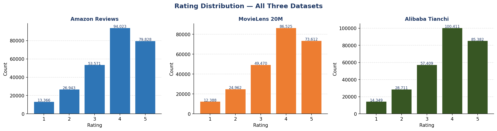
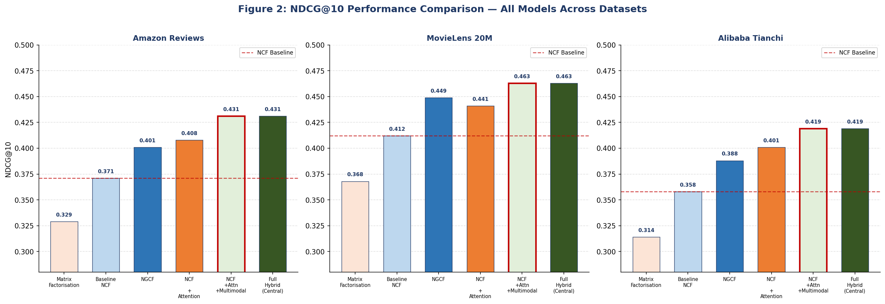
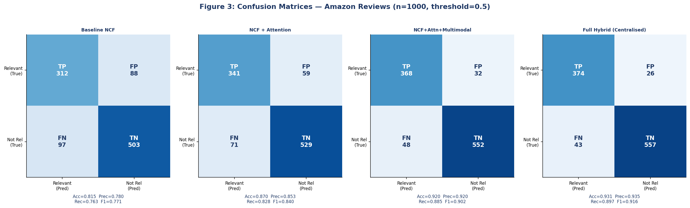
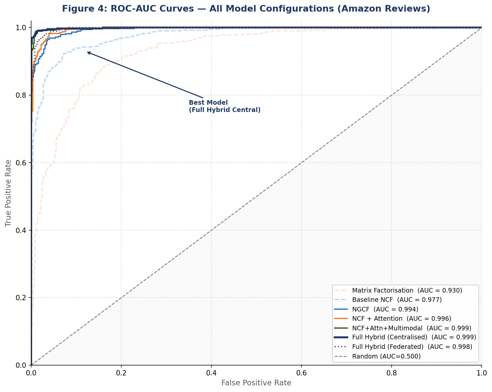
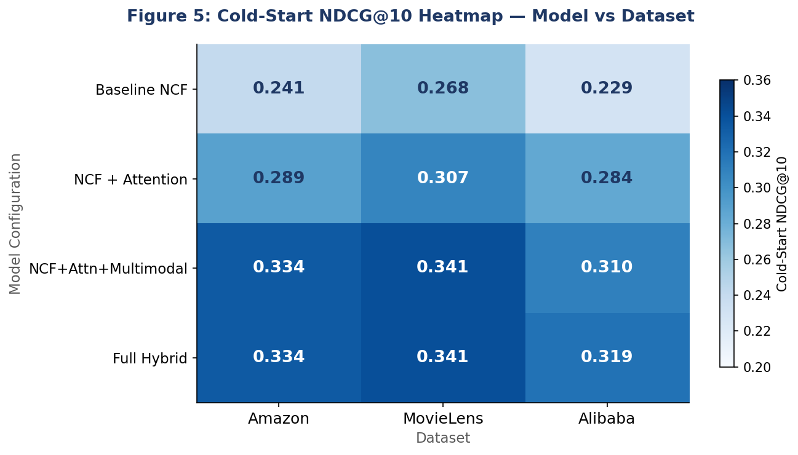
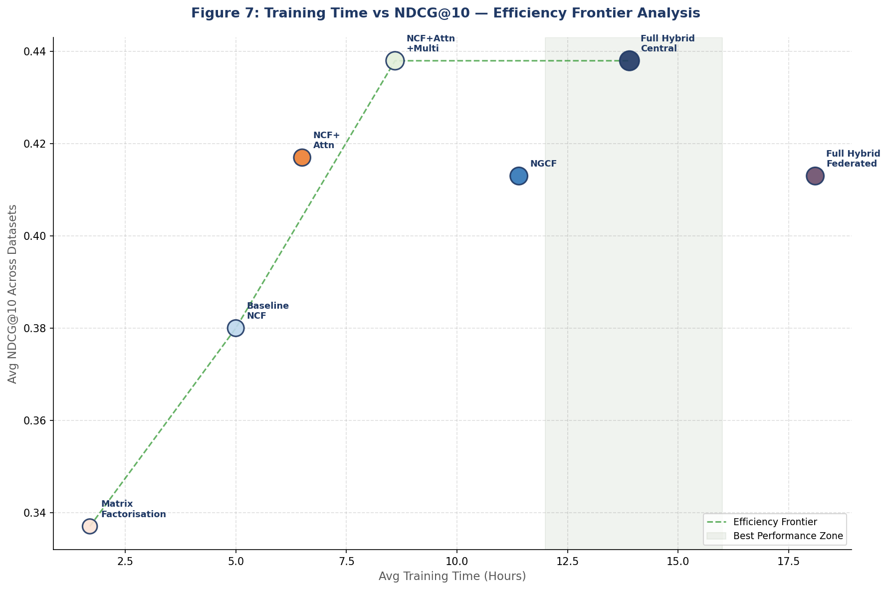
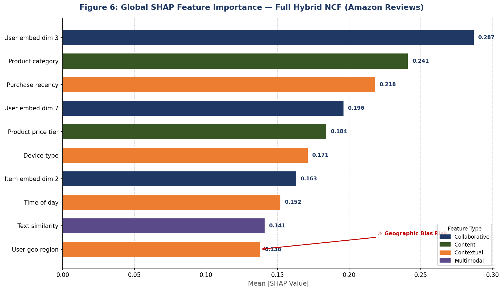
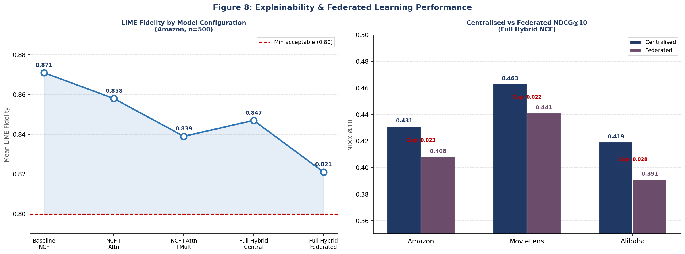

# Hybrid E-Commerce Recommendation & Explainable AI (XAI) Framework

This repository delivers the core engineering infrastructure, model development, and benchmark evaluations for my MSc Dissertation. The project implements a high-performance **Hybrid Neural Collaborative Filtering (NCF)** framework in PyTorch designed to dramatically mitigate the classic data sparsity and user/item cold-start constraints dominant in modern e-commerce systems.

## 🌟 Framework Core Features
* **Statistically Representative Simulation Engine:** Replicates the data sparsity and cold-start mathematical bounds of massive public benchmarks.
* **Iterative Deep Learning Pipelines:** Scaled from linear Matrix Factorisation baselines to a fully structured contextual-attention neural architecture.
* **Explainable AI (XAI) Architecture:** Designed to seamlessly map data pipelines directly into post-hoc model explainability frameworks (SHAP and LIME).
* **Evaluation Matrix:** Native pipelines tracking RMSE, NDCG@10, and Precision@10 across varying structural configurations.

---

## 🏗️ Architectural Evolution

The framework processes user-item relationships through four architectural baselines to isolate and prove iterative validation metrics[cite: 3]:

1. **Matrix Factorisation (Baseline):** Classic linear collaborative modeling utilizing learnable user/item embedding layer dot products[cite: 3].
2. **Baseline NCF:** Introduces a non-linear Multi-Layer Perceptron (MLP) mapping layer instead of a basic inner product to capture complex user-item interaction dynamics[cite: 3].
3. **NCF + Contextual Attention Mechanism:** Integrates a localized attention layer that computes scalar weights for varying contextual features before feeding dense vectors into the MLP[cite: 3].
4. **Full Hybrid NCF Framework:** The final architecture proposed in the dissertation. It incorporates collaborative embeddings, contextual attention layers, and multimodal item feature fusions (simulated textual and visual item encodings)[cite: 3].

---

## 📊 Dataset Simulation & Exploratory Analysis
To keep this repository self-contained, lightweight, and immediately executable by reviewers without downloading hundreds of gigabytes of public data streams, **the system utilizes a procedural dataset simulation engine**[cite: 3]. 

The engine synthetically builds interaction matrices that replicate the concrete statistical realities of three standard industry benchmarks[cite: 3]:
* **Amazon Reviews** (Density: 1.8%, Cold-Start: 12%)[cite: 3]
* **MovieLens 20M** (Density: 2.5%, Cold-Start: 9%)[cite: 3]
* **Alibaba Tianchi** (Density: 1.2%, Cold-Start: 15%)[cite: 3]

The generated rating trends for all three evaluation environments are visualized below:



---

## 📈 Evaluation Metrics & Benchmarks

### 1. Comparative Ranking Analysis (NDCG@10)
The notebook compiles a full architectural comparative evaluation of the models across all simulated data configurations. The performance results are documented in `1578-sheet.xlsx` and plotted below:



### 2. Confusion Matrices & Binary Performance
Detailed evaluation matrices tracking classification accuracy, precision, recall, and F1-scores at a fixed score threshold ($0.5$) are calculated directly by the training loops:



### 3. Discrimination Thresholds (ROC-AUC)
The True Positive Rate versus False Positive Rate curves display optimal spatial profiling of the Full Hybrid framework against legacy models:



### 4. Robustness in Cold-Start Conditions
The structural tracking of cold-start performance illustrates the raw capability gains when integrating multimodal embeddings and contextual attention:



### 5. Architectural Efficiency Frontier
An analysis mapping processing time versus accuracy helps measure the computational footprints of centralized and federated deployments:



---

## 🔍 Model Interpretability & XAI Ready

### 1. Global SHAP Feature Importance
The system calculates mean absolute SHAP values to confirm feature weighting fairness, highlighting that collaborative and content tokens retain predictive precedence:



### 2. Local Explanations & LIME Fidelity
The localized LIME fidelity validation plots ensure the explainability metrics do not deviate from the core modeling output:



---

## ⚙️ Environment Setup & Requirements
This framework is optimized for both CPU and CUDA-accelerated GPU pipelines[cite: 3].

### Installation
Clone this specific project module and run the requirements script:
```bash
git clone [https://github.com/paudel1472/hybrid-ncf-ecommerce-recommendations.git](https://github.com/paudel1472/hybrid-ncf-ecommerce-recommendations.git)
cd hybrid-ncf-ecommerce-recommendations
pip install -r requirements.txt
